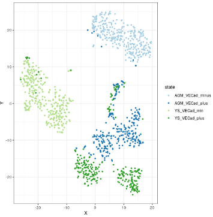
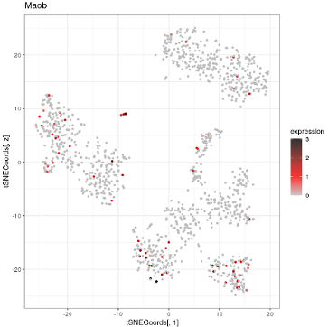
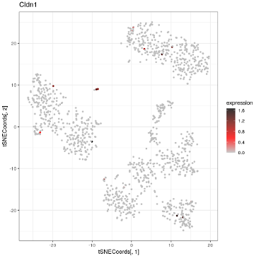

# Introduction

CONCLUS is a tool for robust clustering and positive marker features selection 
of single-cell RNA-seq (sc-RNA-seq) datasets. It is designed to identify rare 
cells populations by consensus clustering. Of note, CONCLUS does not cover 
the preprocessing steps of sequencing files obtained following next-generation 
sequencing. You can find a good resource to start with 
[here](https://scrnaseq-course.cog.sanger.ac.uk/website/index.html). 

CONCLUS is organized into the following steps:

+ Generation of multiple t-SNE plots with a range of parameters including 
different selection of genes extracted from PCA.
+ Use the Density-based spatial clustering of applications with noise 
(DBSCAN) algorithm for idenfication of clusters in each generated t-SNE plot.
+ All DBSCAN results are combined into a cell similarity matrix.
+ The cell similarity matrix is used to define "CONSENSUS" clusters conserved 
accross the previously defined clustering solutions.
+ Identify marker genes for each concensus cluster.


# Getting help

Issues can be submitted directly to the Bioconductor forum using the keyword 
'conclus' in the post title. To contact us directly write to 
christophe.lancrin@embl.it or ilyessr@hotmail.fr. The principles of 
this package were originally developed by Polina Pavlovich who is now doing 
her Ph.D at the Max Planck Institute of Immunobiology and Epigenetics.


# Important note

Due to the stochastic aspect of tSNE, everything was generated with a random 
seed of 42 (default parameter of `generateTSNECoordinates`) to ensure 
reproducibility of the results. Because of the evolution of biomaRt, you might 
get slightly different figures. However, the marker genes for each cluster 
should be the same.

The package is currently limited to mouse and human. Other organisms can be 
added on demand. Write to christophe.lancrin@embl.it or ilyessr@hotmail.fr. 
Priority will be given to model organisms.


# Standard workflow

## Quick start

CONCLUS requires to start with a raw-count matrix with reads or unique 
molecular identifiers (UMIs). The columns of the count matrix must contain 
cells and the rows -- genes. CONCLUS needs a large number of cells to collect 
statistics, we recommend using CONCLUS if you have at least 100 cells.

In the example below, a small toy example is used to illustrate the 
runCONCLUS method. Real data are used later in this vignette.

```{r runConclus_first}

library(conclus)

outputDirectory <- "./testDirectory"
experimentName <- "Test"
species <- "mouse"

countmatrixPath <- file.path(system.file("extdata", package = "conclus"),
                                 "test_countMatrix.tsv")
countMatrix <- loadDataOrMatrix(file=countmatrixPath, type="countMatrix")

coldataPath <- system.file("extdata/test_colData_filtered.tsv", 
                            package = "conclus")                 
columnsMetaData <- loadDataOrMatrix(file=coldataPath, type="coldata", 
                        columnID="cellName")

sceObjectCONCLUS <- runCONCLUS(outputDirectory, experimentName, countMatrix, 
        species, columnsMetaData = columnsMetaData)
```

In your "outputDirectory", the sub-folder `pictures` contains all tSNE with 
dbscan coloration (sub-folder `tSNE_pictures`), the cell similarity matrix (
`Test_cells_correlation_X_clusters.pdf`), the cell heatmap 
(`Test_clustersX_meanCenteredTRUE_orderClustersFALSE_orderGenesFALSE
markersPerCluster.pdf`), and the cluster similarity matrix 
(`Test_clusters_similarity_10_clusters.pdf`). You will also find in the 
sub-folder `Results`: 

+ `1_MatrixInfo`: The normalized count matrix and its meta-data for both rows 
and columns.
+ `2_TSNECoordinates`: The tSNE coordinates for each parameter of principal
components (PCs) and perplexities.
+ `3_dbScan`: The different clusters given by DBscan according to different
parameters. Each file gives a cluster number for each cell.
+ `4_CellSimilarityMatrix`: The matrix underlying the cells similarity
heatmap.
+ `5_ClusterSimilarityMatrix`: The matrix underlying the clusters similarity 
heatmap.
+ `6_ConclusResult`: A table containing the result of the consensus clustering.
This table contains two columns: clusters-cells.
+ `7_fullMarkers`: Files containing markers for each cluster, defined by the
consensus clustering.
+ `8_TopMarkers`: Files containing the top 10 markers for each cluster.
+ `9_genesInfos`: Files containing gene information for the top markers 
defined in the previous folder.


Further details about how all these results are generated can be found below.


## Data

In this vignette, we demonstrate how to use CONCLUS on a sc-RNA-seq dataset 
from [Shvartsman *et al*](https://www.biorxiv.org/content/10.1101/774547v1).
The Yolk Sac (YS) and Aorta-Gonad-Mesonephros (AGM) are two major 
haematopoietic regions during embryonic development. Interestingly, AGM is the 
only one generating haematopoietic stem cells (HSCs). To identify the 
difference between AGM and YS, Shvartsman *et al* compared them using 
single cell RNA sequencing between 9.5 and 11.5 days of mouse embryonic 
development. This vignette aims at reproducing the identification of a rare 
population corresponding to liver like cells in the YS at day 11.5. The number 
of clusters used in this vignette is lower than in the original article for 
sake of simplification. This vignette neither provides a description of the 
differences between the AGM and YS. Please refer to Shvartsman *et al* for 
a complete description. 

Since endothelial cells represent a small population in these tissues, 
cells expressing the endothelial marker VE-Cadherin (VE-Cad, also called Cdh5) 
were enriched and sorted, VE-Cad Negative cells constituting the 
microenvironment. Therefore, four cell states are defined by the cell 
barcodes: YS VE-Cad minus, AGM VE-Cad minus, YS VE-Cad minus, and AGM 
VE-Cad minus. The E11.5 data are constituted of 1482 cells. After filtering 
and normalization, 1303 cells were retained.  

This sc-RNA-seq experiment was performed using the SMARTer ICELL8 Single-Cell 
System ([Click here for more info](https://www.takarabio.com/learning-centers/automation-systems/icell8-introduction/icell8-technology-overview)). 
The protocol was based on 3' end RNA sequencing where each mRNA molecule is 
labeled with a unique molecular identifier (UMI) during reverse transcription 
in every single cell.

Shvartsman *et al* deleted highly abundant haemoglobins having names 
starting with ‘Hba’ or ‘Hbb’ because they seemed to be the primary source of 
contamination. Additionally, they excluded poorly annotated genes that did not 
have gene symbols to improve the clusters annotation process. Finally, the 
human cell controls were removed.

### Retrieving data from GEO

The code below format the count matrix and the columns meta-data. The source 
data are downloaded from the GEO page 
[GSE161933](https://www.ncbi.nlm.nih.gov/geo/query/acc.cgi?acc=GSM4923493). 
The URL of the count matrix and the cells meta-data were retrieved by 
right-click and 'copy link adress' on the http hyperlink of the supplementary 
file at the bottom of the page. If the columns metadata are not available in 
the supplementary file section, the name of the series matrix, containing 
columns meta-data can be retrieved by clicking the 'Series Matrix File(s)' 
link just above the count matrix. The function `retrieveFromGEO` used with the 
parameter seriesMatrixName will download all series matrices present in the 
GEO record however only the one of interest will be kept.

```{r format_data}

outputDirectory <- "./YourOutputDirectory"
dir.create(outputDirectory, showWarnings=FALSE)
species <- "mouse"

countMatrixPath <- file.path(outputDirectory, "countmatrix.txt")
metaDataPath <- file.path(outputDirectory, "metaData.txt")
matrixURL <- paste0("https://www.ncbi.nlm.nih.gov/geo/download/?acc=GSM492",
"3493&format=file&file=GSM4923493%5FE11%5F5%5Frawcounts%5Fmatrix%2Etsv%2Egz")
metaDataURL <- paste0("https://www.ncbi.nlm.nih.gov/geo/download/?acc=",
"GSM4923493&format=file&file=GSM4923493%5FMetadata%5FE11%5F5%2Etxt%2Egz")

result <- retrieveFromGEO(matrixURL, countMatrixPath, species, 
metaDataPath=metaDataPath, colMetaDataURL=metaDataURL)
countMatrix <- result[[1]]
columnsMetaData <- result[[2]]

## Correct the columns names to fit conclus input requirement
## The columns should be: cellName, state, and cellBarcode
columnsMetaData <- columnsMetaData[,c(1,3,2)]
colnames(columnsMetaData) <- c("cellName", "state", "cellBarcode")

## Removing embryonic hemoglobins with names starting with "Hba" or "Hbb"
idxHba <- grep("Hba", rownames(countMatrix))
idxHbb <- grep("Hbb", rownames(countMatrix))
countMatrix <- countMatrix[-c(idxHba, idxHbb),]

## Removing control human cells
idxHumanPos <- which(columnsMetaData$state == "Pos Ctrl")
idxHumanNeg <- which(columnsMetaData$state == "Neg Ctrl")
columnsMetaData <- columnsMetaData[-c(idxHumanPos, idxHumanNeg),]
countMatrix <- countMatrix[,-c(idxHumanPos, idxHumanNeg)]

## Removing genes not having an official symbol
idxENS <- grep("ENSMUSG", rownames(countMatrix))
countMatrix <- countMatrix[-idxENS,]
```

### Using local data

If you executed the code above, a matrix path is stored in `countMatrixPath` 
and a file path to the meta-data is stored in `metaDataPath`. Just indicate 
the paths to your files in this two variables:

```{r local_data, eval=FALSE}

## countMatrixPath <- ""
## metaDataPath <- ""

countMatrix <- loadDataOrMatrix(countMatrixPath, type="countMatrix")
columnsMetaData <- loadDataOrMatrix(file=metaDataPath, type="coldata", 
                                    columnID="Cell_ID")

## Filtering steps to add here as performed above
``` 

## Test clustering

The *TestClustering* function runs one clustering round out of the 84 
(default) rounds that CONCLUS normally performs. This step can be useful to 
determine if the default DBSCAN parameters are suitable for your dataset. By 
default, they are *dbscanEpsilon = c(1.3, 1.4, 1.5)* and *minPts = c(3,4)*. If 
the dashed horizontal line in the k-NN distance plot lays on the “knee” of the 
curve (as shown below), it means that optimal epsilon is equal to the 
intersection of the line to the y-axis. In our example, optimal epsilon is 
1.4 for 5-NN distance where 5 corresponds to MinPts. 

In the "test_clustering" folder under outputDirectory, the three plots below 
will be saved where one corresponds to the “distance_graph.pdf”, another one 
to "test_tSNE.pdf" (*p[[1]]*), and the last one will be saved as 
"test_clustering.pdf" (*p[[2]]*).


```{r normalization_1}

## Creation of the single-cell RNA-Seq object
scr <- singlecellRNAseq(experimentName = "E11_5", 
        countMatrix     = countMatrix, 
        species         = "mouse",
        outputDirectory = outputDirectory)

## Normalization of the count matrix
scr <- normaliseCountMatrix(scr, coldata=columnsMetaData)
```


```{r testClustering, results="hide"}
p <- testClustering(scr, writeOutput=TRUE, silent=TRUE)
```


```{r testClustering_result1, results="hide", fig.keep = 'none'}
# saved as "outputDirectory/test_clustering/test_tSNE.pdf"
p[[1]]
```


```{r testClustering_result2, results="hide", fig.keep = 'none'}
# saved as "outputDirectory/test_clustering/test_clustering.pdf"
p[[2]]
```


# CONCLUS step by step

The wrapper function runCONCLUS is organized into 7 steps:

+ Normalization of the counts matrix
+ Generation of t-SNE coordinates
+ Clustering with DB-SCAN
+ Cell and cluster similarity matrix calculation
+ Plotting
+ Marker genes identification
+ Results export


## Normalization of the counts matrix

sc-RNA-seq datasets are quite challenging notably because of sparsity (many 
genes are not detected consistently yielding expression matrices with many 
zeroes) and also because of technical noise. To facilitate analysis, one needs 
to perform a step of normalization which allows for the correction of unwanted 
technical and biological noises (click [here](
https://www.ncbi.nlm.nih.gov/pmc/articles/PMC5549838/) for a complete review on
normalization techniques).

CONCLUS uses 
[Scran](https://bioconductor.org/packages/release/bioc/html/scran.html) and 
[Scater](http://www.bioconductor.org/packages/release/bioc/html/scater.html) 
packages for normalization. Beforehand, the function will annotate genes 
creating *rowData* and add statistics about cells into *columnsMetaData*. If 
you already have *columnsMetaData* and *rowData*, you can give it to the 
function (see manual). It will keep your columns and add new ones at the end. 
If you do not want to lose any cell after quality metrics check, select 
*alreadyCellFiltered = TRUE*, by default it is *FALSE*. Before *scran* and 
*scater* normalization, the function will call *scran::quickCluster* (see 
manual for details). If you want to skip this step, set *runQuickCluster = 
FALSE*, by default it is *TRUE*. We advice to first try the analysis with this 
option and to set it to FALSE if no rare populations are found. 

```{r normalization_2, eval = FALSE}
scr <- normaliseCountMatrix(scr, coldata=columnsMetaData)
```

The method *normaliseCountMatrix* returns a scRNASeq object with its sceNorm 
slot updated. This slot contains a SingleCellExperiment object having the 
normalized count matrix, the colData (table with cells informations), and the 
rowData (table with the genes informations). See ?SingleCellExperiment for 
more details. 


The rowdata can help to study cross-talk between cell types or find surface 
protein-coding marker genes suitable for flow cytometry. The columns with the 
GO terms are *go_id* and *name_1006* (see manual).

The slots can be accessed as indicated below:

```{r normalization_results}
## Accessing slots
originalMat <- getCountMatrix(scr)
SCEobject <- getSceNorm(scr)
normMat <- SingleCellExperiment::logcounts(SCEobject)

# checking what changed after the normalisation
dim(originalMat)
dim(normMat)

# show first columns and rows of the count matrix
originalMat[1:5,1:5]

# show first columns and rows of the normalized count matrix
normMat[1:5,1:5]

# visualize first rows of metadata (coldata)
coldataSCE <- as.data.frame(SummarizedExperiment::colData(SCEobject))
head(coldataSCE)

# visualize beginning of the rowdata containing gene information
rowdataSCE <- as.data.frame(SummarizedExperiment:::rowData(SCEobject))
head(rowdataSCE)
```

## Generation of t-SNE coordinates

*runCONCLUS* generates an object of fourteen (by default) tables with tSNE 
coordinates. Fourteen because it will vary seven values of principal 
components *PCs=c(4, 6, 8, 10, 20, 40, 50)* and two values of perplexity 
*perplexities=c(30, 40)* in all possible combinations. 

The chosen values of PCs and perplexities can be changed if necessary. We 
found that this combination works well for sc-RNA-seq datasets with 400-2000 
cells. If you have 4000-9000 cells and expect more than 15 clusters, we 
recommend to use more first PCs and higher perplexity, for example, *PCs=c(8, 
10, 20, 40, 50, 80, 100)* and *perplexities=c(200, 240)*. For details about 
perplexities parameter see ‘?Rtsne’.


```{r tsne_generation}
scr <- generateTSNECoordinates(scr)
```

Results can be explored as follows:


```{r tsne_showResults}
tsneList <- getTSNEList(scr)
head(getCoordinates(tsneList[[1]]))
```


## Clustering with DB-SCAN

Following the calculation of t-SNE coordinates, DBSCAN is run with a range of 
epsilon and MinPoints values which will yield a total of 84 clustering 
solutions (PCs x perplexities x MinPoints x epsilon). *minPoints* is the 
minimum cluster size which you assume to be meaningful for your experiment and 
*epsilon* is the radius around the cell where the algorithm will try to find 
*minPoints* dots. Optimal *epsilon* must lay on the knee of the k-NN function 
as shown in the "test_clustering/distance_graph.pdf" (See Test clustering 
section above).


```{r runDBSScan}
scr <- runDBSCAN(scr)
```

Results can be explored as follows:


```{r dbscan_showResults}
dbscanList <- getDbscanList(scr)
clusteringList <- lapply(dbscanList, getClustering)
clusteringList[[1]][,1:10]
```

## Cell and cluster similarity matrix calculation

The above calculated results are combined together in a matrix called “cell 
similarity matrix”. *runDBSCAN* function returns an object of class scRNASeq 
with its dbscanList slot updated. The list represents 84 clustering solutions 
(which is equal to number of PCs x perplexities x MinPoints x epsilon). Since 
the range of cluster varies from result to result, there is no exact match 
between numbers in different elements of the list. Cells having the same 
number within an element are guaranteed to be in one cluster. We can calculate 
how many times out of 84 clustering solutions, every two cells were in one 
cluster and that is how we come to the similarity matrix of cells. We want to 
underline that a zero in the dbscan results means that a cell was not assigned 
to any cluster. Hence, cluster numbers start from one. *clusterCellsInternal* 
is a general method that returns an object of class scRNASeq with its 
cellsSimilarityMatrix slot updated.
      
Note that the number of clusters is set to 10 (it was set to 11 in the 
original study, see data section). Considering that clusters can 
be merged afterwards (see Supervised clustering section), we advise to keep 
this number. One might want to increase it if the cell similarity matrix or 
the tSNE strongly suggest more clusters but this number is suitable for most 
experiments in our hands.

```{r clusterCellsInternal}
scr <- clusterCellsInternal(scr, clusterNumber = 10)
```

```{r clusterCellsInternal_showResults}
cci <- getCellsSimilarityMatrix(scr)
cci[1:10,1:10]
```

After looking at the similarity between elements on the single-cell level, 
which is useful if we want to understand if there is any substructure which we 
did not highlight with our clustering, a "bulk" level where we pool all cells 
from a cluster into a representative "pseudo cell" can also be generated. This 
gives a *clusterSimilarityMatrix*:

```{r clustersSimilarityMatrix}
scr <- calculateClustersSimilarity(scr)
csm <- getClustersSimilarityMatrix(scr)
csm[1:10,1:10]
```


## Plotting


### t-SNE colored by clusters or conditions

CONCLUS generated 14 tSNE combining different values of PCs and perplexities. 
Each tSNE can be visualized either using coloring reflecting the results of 
DBScan clustering, the conditions (if the metadata contain a 'state' column) 
or without colors. Here *plotClusteredTSNE* is used to generate all these 
possibilities of visualization. 


```{r plotClustered}
tSNEclusters <- plotClusteredTSNE(scr, columnName="clusters", 
                returnPlot=TRUE, silentPlot=TRUE)
                
tSNEnoColor <- plotClusteredTSNE(scr, columnName="noColor", 
                returnPlot=TRUE, silentPlot=TRUE)
                
tSNEstate <- plotClusteredTSNE(scr, columnName="state", 
                returnPlot=TRUE, silentPlot=TRUE)                
```

For visualizing the 5th (out of 14) tSNE cluster:

```{r plotClustered_visualization1, results="hide", fig.keep = 'none'}
tSNEclusters[[5]]
```


This tSNE suggests that the cluster 8 corresponds to a rare population of 
cells. We can also appreciate that clusters 1 and 2, as clusters 9 and 10 
could be considered as single clusters respectively.

For visualizing the 5th (out of 14) tSNE cluster without colors:

```{r plotClustered_visualization2, results="hide", fig.keep = 'none'}
tSNEnoColor[[5]]
```


For visualizing the 5th (out of 14) tSNE cluster colored by state:

```{r plotClustered_visualization3, results="hide", fig.keep = 'none'}
tSNEstate[[5]]
```



One can see that the cluster 8 contains only cells of the YS.

\newpage

### Cell similarity heatmap

The *cellsSimilarityMatrix* is then used to generate a heatmap summarizing the 
results of the clustering and to show how stable the cell clusters are across 
the 84 solutions.

```{r plotCellSimilarity, results="hide", fig.keep = 'none'}
plotCellSimilarity(scr)
```


*CellsSimilarityMatrix* is symmetrical and its size proportional to the 
"number of cells x number of cells". Each vertical or horizontal tiny strip is 
a cell. Intersection shows the proportion of clustering iterations in which a 
pair of cells was in one cluster (score between 0 and 1, between blue and 
red). We will call this combination "consensus clusters" and use them 
everywhere later. We can appreciate that cellsSimilarityMatrix is the first 
evidence showing that CONCLUS managed not only to distinguish VE-Cad plus 
cells from the VE-Cad minus but also find sub-populations within these groups.

### Cluster similarity heatmap

```{r plotClustersSimilarity, results="hide", fig.keep = 'none'}  
plotClustersSimilarity(scr)
```


In the *clusterSimilarityMatrix*, we can see that all clusters have a high 
value of similarity across all clustering solutions. Red color on the diagonal 
means that the group is homogenous, and usually, it is what we want to get. 
The yellow on the diagonal indicates that either that group consists of two or 
more equal sized subgroups. The orange on the diagonal suggests that groups 
can be merged. Bluish color points to a cluster of dbscan "outliers" that 
usually surrounds dense clouds of cells in t-SNE plots.

As observed previously on the tSNE, clusters 1 and 2 as 9 and 10 are very 
similar. Clusters 3 and 8 are very different. 


## Marker genes identification

To understand the nature of the consensus clusters identified by CONCLUS, it is 
essential to identify genes which could be classified as marker genes for each 
cluster. To this aim, each gene should be "associated" to a particular 
cluster. This association is performed by looking at up-regulated genes in a 
particular cluster compared to the others (multiple comparisons). The method 
*rankGenes* performs multiple comparisons of all genes from the object and 
rank them according to a score reflecting a FDR power.

In summary, the method *conclus::rankGenes()* gives a list of marker genes 
for each cluster, ordered by their significance. See ?rankGenes for more 
details.

```{r rankGenes}
scr <- rankGenes(scr)
```

```{r rankGenes_result}
markers <- getMarkerGenesList(scr)
head(markers[[1]])
```

The top 10 markers by cluster (default) can be selected with:


```{r topMarkers_result}
scr <- retrieveTopClustersMarkers(scr, removeDuplicates=TRUE)
topMarkers <- getClustersMarkers(scr)
topMarkers
```

Cluster 8 contains the marker genes A2m, Cldn1, Maob, Pcbd1, Pdzk1, Krt20, 
Klb, Serpind1, and F2. Alpha-2-Macroglobulin (A2m) is a large (720 KDa) plasma 
protein found in the blood and is mainly produced by the liver; Claudins 
(CLDNs) are a family of integral membrane proteins, Cldn1 being expressed by 
epithelial liver cells; The  monoamine oxidase (Maob) is found in abundance in 
the liver. All these markers play a role in the liver. This sub-population 
is hence called liver-like hereafter. 


# Plot a heatmap with positive marker genes

Following the execution of the `retrieveTopClustersMarkers` method, CONCLUS 
offers the option to visualize the marker genes on a heatmap. Below we chose 
to show the selected 10 marker genes per cluster which should generate a 
heatmap with 100 genes (10 marker genes x 10 clusters). This is convenient for 
visualization. In practice, the number of genes in this heatmap will be less 
than 100 because some genes were classified as markers for more than one 
cluster. This can happen when several clusters correspond to similar cellular 
types.

After selecting the top markers with the method `retrieveTopClustersMarkers`, 
the method *plotCellHeatmap* is used to order clusters and genes by similarity 
(the same order as in the *clusterSimilarityMatrix*) and show mean-centered 
normalized data. Mean-centering allows seeing the relative expression of a gene 
compared to the mean.


```{r plotCellHeatmap_marker1, results="hide", fig.keep = 'none'}
plotCellHeatmap(scr, orderClusters=TRUE, orderGenes=TRUE)
```


One can also visualize the heatmap without mean centering and appreciate the 
importance of the normalization of colors by row. Indeed, the different 
markers are much harder to identify.

```{r plotCellHeatmap_marker2, results="hide", fig.keep = 'none'}
plotCellHeatmap(scr, orderClusters=TRUE, orderGenes=TRUE, meanCentered=FALSE)
```


Alternative order of clusters is by name or by hierarchical clustering as in 
the default pheatmap function.


# Plot t-SNE colored by expression of a selected gene


*PlotGeneExpression* allows visualizing the normalized expression of one gene 
in a t-SNE plot. It can be useful to inspect the specificity of top markers.

Cluster 8 was identified as being a liver-like rare population. Below are 
examples of the expression of its marker genes:

```{r plotGeneExpression1, eval=FALSE}
plotGeneExpression(scr, "Maob", tSNEpicture=5)
```



```{r plotGeneExpression2, eval=FALSE}
plotGeneExpression(scr, "Pcbd1", tSNEpicture=5)
```


```{r plotGeneExpression3, eval=FALSE}
plotGeneExpression(scr, "Serpinf2", tSNEpicture=5)
```


```{r plotGeneExpression4, eval=FALSE}
plotGeneExpression(scr, "Cldn1", tSNEpicture=5)
```




# Collect publicly available info about marker genes

## Collect information for the top 10 markers for each cluster

`retrieveGenesInfo` retrieves gene information from NCBI, MGI, and UniProt. 
It requires the `retrieveTopMarkers` method to have been run on the object.


```{r getGenesInfo}
scr <- retrieveGenesInfo(scr)
result <- getGenesInfos(scr)
head(result)
```

`result` contains the following columns:

+ uniprot_gn_symbol: Uniprot gene symbol.
+ clusters: The cluster to which the gene is associated.
+ external_gene_name: The complete gene name.
+ go_id: Gene Ontology (GO) identification number.
+ mgi_description: If the species is mouse, description of the gene on MGI.
+ entrezgene_description: Description of the gene by the Entrez database.
+ gene_biotype: protein coding gene, lincRNA gene, miRNA gene, 
unclassified non-coding RNA gene, or pseudogene.
+ chromosome_name: The chromosome on which the gene is located.
+ Symbol: Official gene symbol.
+ ensembl_gene_id: ID of the gene in the ensembl database.
+ mgi_id: If the species is mouse, ID of the gene on the MGI database.
+ entrezgene_id: ID of the gene on the entrez database.
+ uniprot_gn_id: ID of the gene on the uniprot database.


# Supervised clustering 

Until now, we have been using CONCLUS in an unsupervised fashion. This is a 
good way to start the analysis of a sc-RNA-seq dataset. However, the knowledge 
of the biologist remains a crucial asset to get the maximum of the data. 
This is why we have included in CONCLUS, additional options to do supervised 
analysis (or “manual” clustering) to allow the researcher to use her/his 
biological knowledge in the CONCLUS workflow. Going back to the example of 
the Shvartsman *et al.* dataset above (cluster similarity heatmap), one can 
see that some clusters clearly belong to the same family of cells after 
examining the clusters_similarity matrix generated by CONCLUS.

As previously mentioned, clusters 1 and 2 as 9 and 10 are very similar. In 
order to figure out what marker genes are defining these families of clusters, 
one can use manual clustering in CONCLUS to fuse clusters of similar nature: 
i.e. combine clusters 1 and 2 (9 and 10) together.

```{r merging_clusters}
## Retrieving the table indicating to which cluster each cell belongs
clustCellsDf <- retrieveTableClustersCells(scr)

## Replace "2/10" by "1/9" to merge 1/2 and 9/10
clustCellsDf$clusters[which(clustCellsDf$clusters == 2)] <- 1
clustCellsDf$clusters[which(clustCellsDf$clusters == 10)] <- 9

## Modifying the object to take into account the new classification
scrUpdated <- addClustering(scr, clusToAdd=clustCellsDf)
```

Now we can visualize the new results taking into account the new classification:

```{r addClusteringManually_visualization2, results="hide", fig.keep = 'none'}
plotCellSimilarity(scrUpdated)
```


```{r addClusteringManually_visualization3, results="hide", fig.keep = 'none'}
plotCellHeatmap(scrUpdated, orderClusters=TRUE, orderGenes=TRUE)
```


```{r addClusteringManually_visualization4, results="hide", fig.keep = 'none'}
tSNEclusters <- plotClusteredTSNE(scrUpdated, columnName="clusters", 
                                    returnPlot=TRUE, silentPlot=TRUE)
tSNEclusters[[5]]
```


The cell heatmap above shows that Col1a1 is a good marker of cluster 1 and 
that Cdk8 is a good marker of cluster 9 (at the bottom). One can visualize 
them in the t-SNE plots below.

```{r replot1, eval=FALSE}
plotGeneExpression(scrUpdated, "Col1a1", tSNEpicture=5)
```


```{r replot2, eval=FALSE}
plotGeneExpression(scrUpdated, "Cdk8", tSNEpicture=5)
```


# Conclusion

Here we demonstrated how to use CONCLUS and combine multiple parameters 
testing for sc-RNA-seq analysis. It allowed us to identify a rare population 
in the data of Shvartsman *et al* and will help gaining deeper insights into 
others. 
  

# Session info

```{r sessionInfo}
sessionInfo()
```
